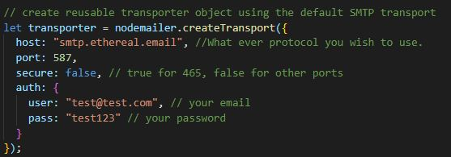
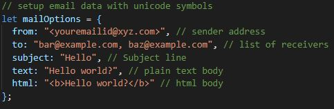
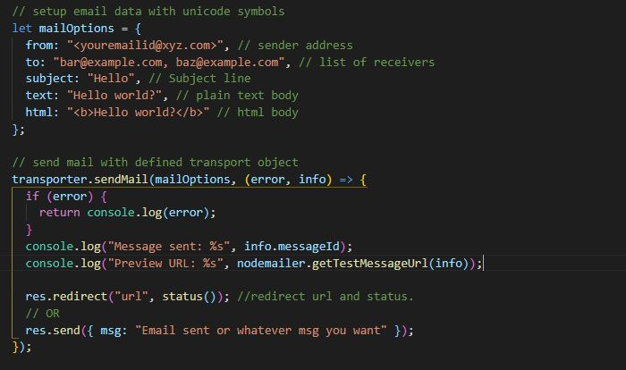

step 1: Download or clone the project.

step 2: npm install.

step 3: npm start.

There are few things that you should fix before send mail.
1:- create reusable transporter object using the default SMTP transport 

 

2:- setup email data with unicode symbols 

 

3:- send mail with defined transport object 

